

# 🎓 DISCIPLIFY System v2.5 - Sistema Completo de Gestión de Discipulado

  <strong>Sistema profesional para gestión de discipulado en iglesias y comunidades cristianas</strong>

## 🚀 **Características Principales:**
- ✅ Sistema multi-rol: Admin, Mentor, Alumno
- ✅ Gestión completa de usuarios del sistema
- ✅ Carga académica y planificación de cursos
- ✅ Sistema de sesiones y seguimiento personalizado
- ✅ Evaluaciones con cuadro 01 para calificaciones
- ✅ Cálculo automático de promoción de grados
- ✅ Gestión de graduados y historial académico completo
- ✅ Diseño 100% responsivo y user-friendly

## 👥 **3 Roles Específicos:**
- **Administrador:** Control total del sistema y configuración
- **Mentor:** Gestión de alumnos, sesiones, evaluaciones y seguimiento
- **Alumno:** Acceso a materiales, seguimiento personal, calificaciones

## 📊 **Módulos Implementados:**
1. **Gestión de Usuarios** - Administración completa de 3 roles
2. **Carga Académica** - Plan de estudios y cursos
3. **Sesiones de Discipulado** - Programación y seguimiento
4. **Sistema de Evaluaciones** - Con cuadro 01 para calificaciones
5. **Cálculo Automático de Promoción** - Lógica inteligente
6. **Gestión de Graduados** - Historial y certificados
7. **Reportes y Estadísticas** - Análisis completo
8. **Panel de Control Multi-rol** - Interfaces personalizadas

## 📸 **Capturas de Pantalla:**

| Vista | Descripción |
|-------|-------------|
|  | **Pantalla de inicio de sesión** - Acceso seguro al sistema |
| 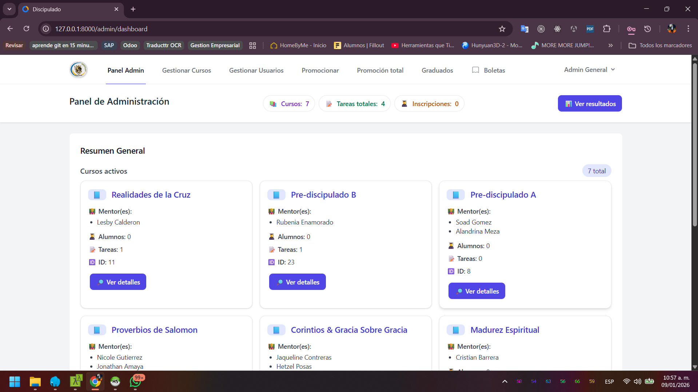 | **Panel de administración** - Vista completa del administrador |
| 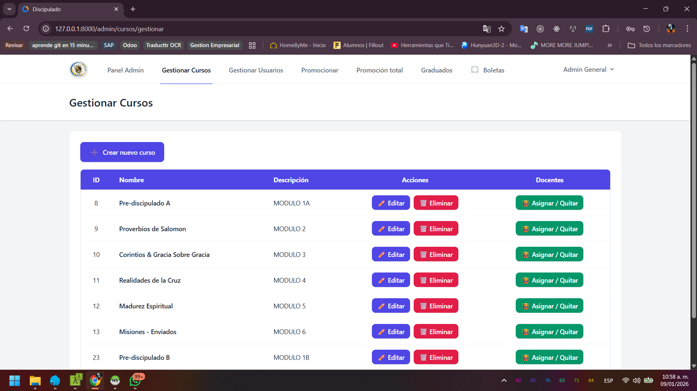 | **Gestión de cursos** - Administración académica |
|  | **Vista adicional de cursos** - Detalles de programación |
| 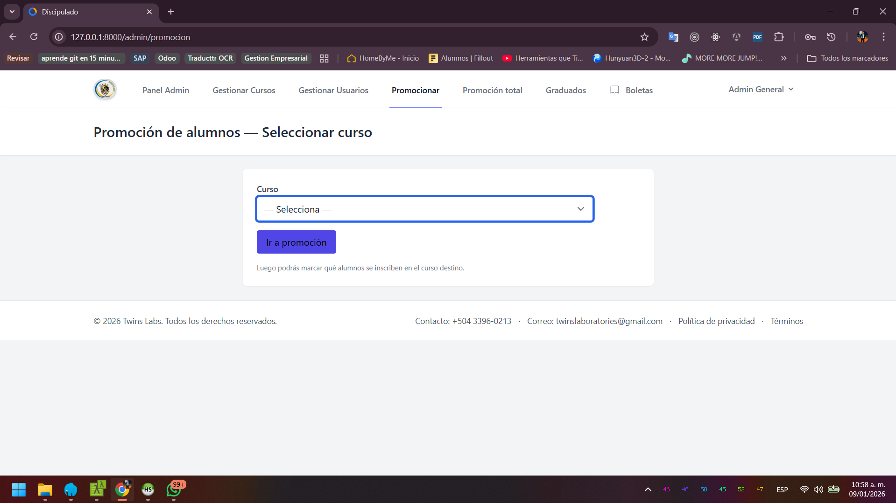 | **Sistema de promoción** - Control de avance académico |
|  | **Vista completa de promoción** - Reportes consolidados |
| 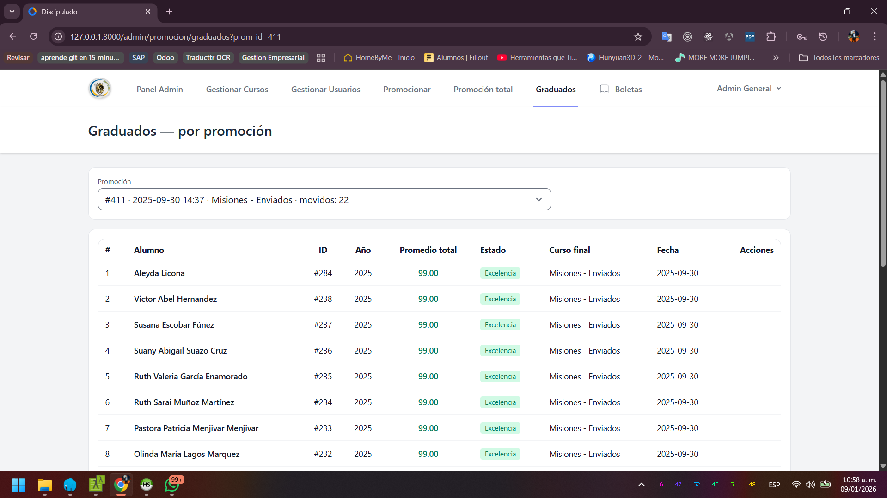 | **Gestión de graduados** - Alumnos completados |
| 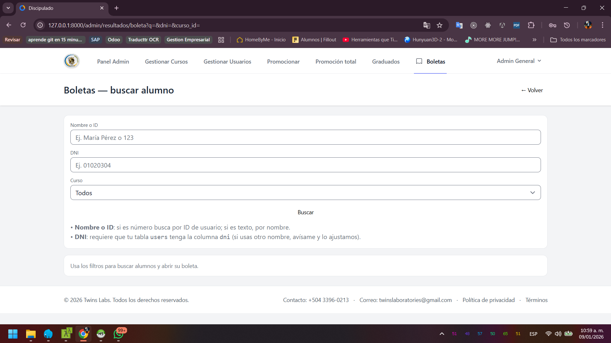 | **Boletas de calificaciones** - Reportes académicos |
| 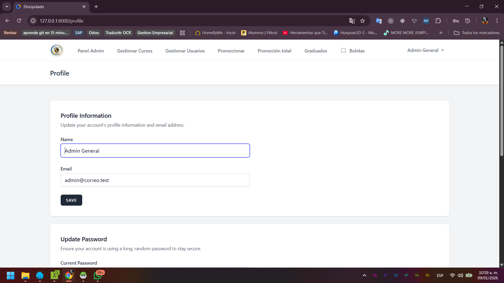 | **Perfil de usuario** - Información personal |
| 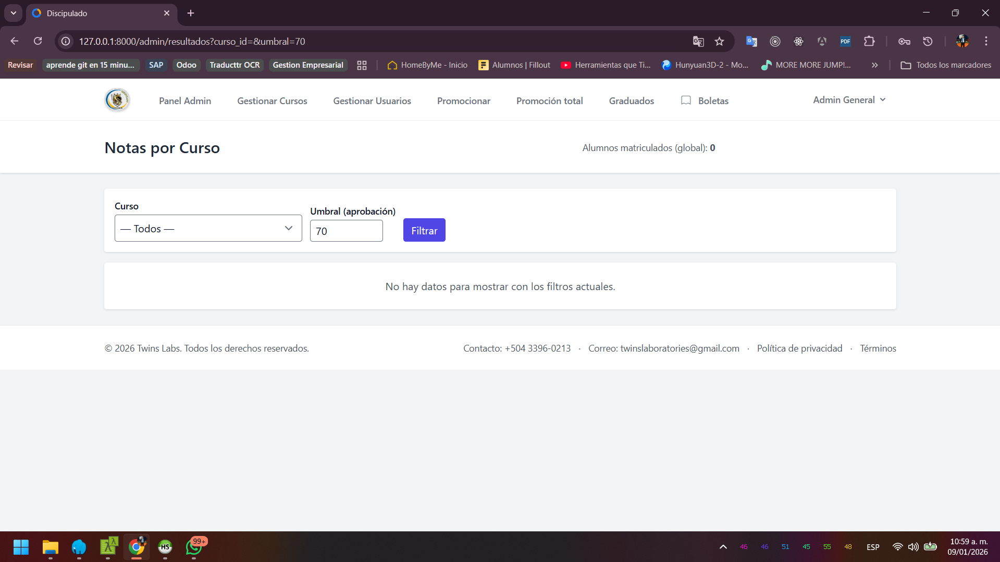 | **Notas por curso** - Evaluaciones organizadas |
| 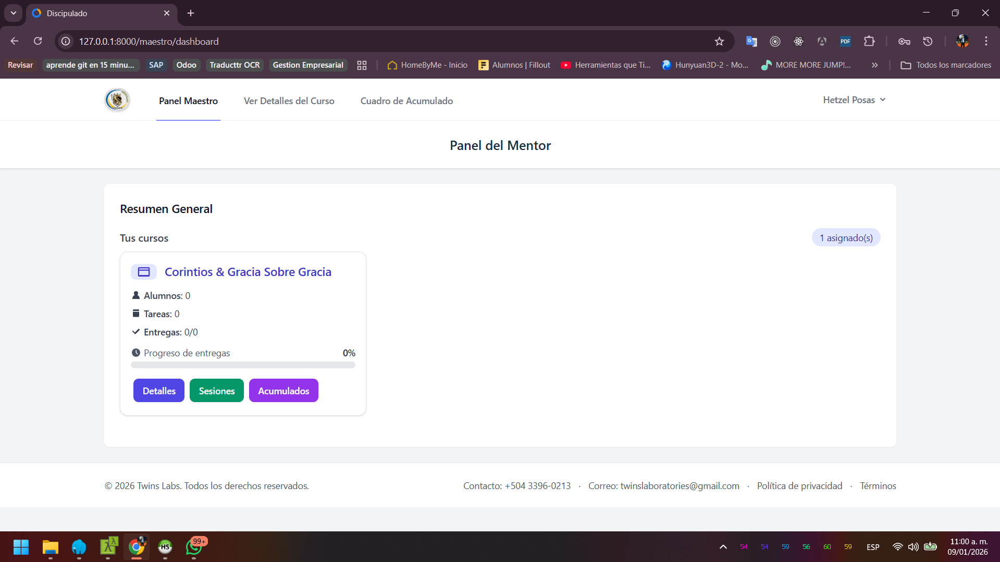 | **Panel del mentor** - Vista especializada |
| 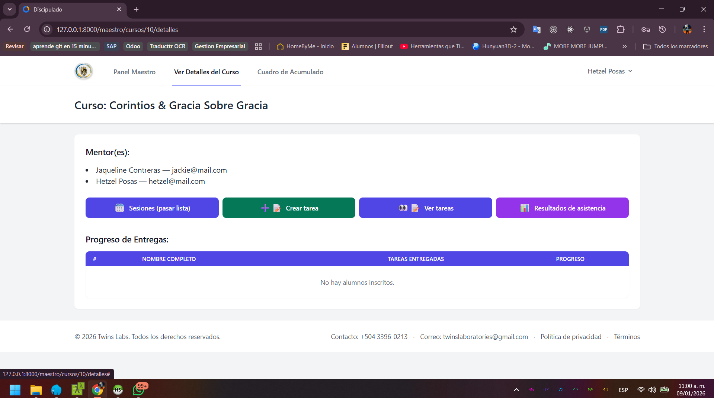 | **Herramientas del curso** - Recursos educativos |
| 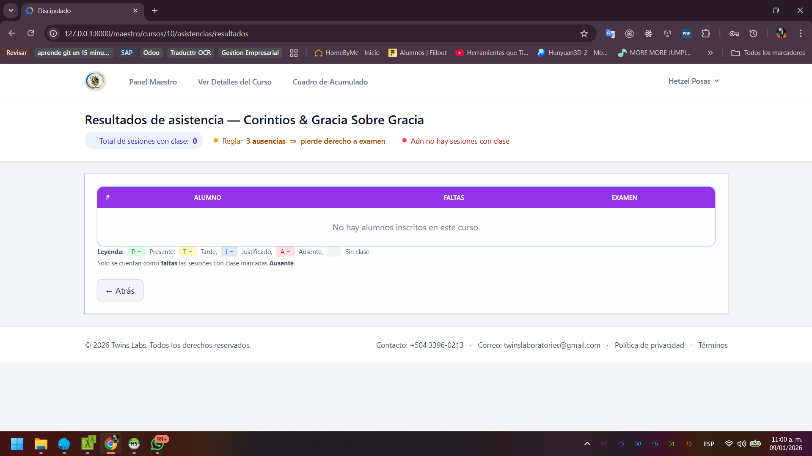 | **Sistema de asistencia** - Control de presencia |
| 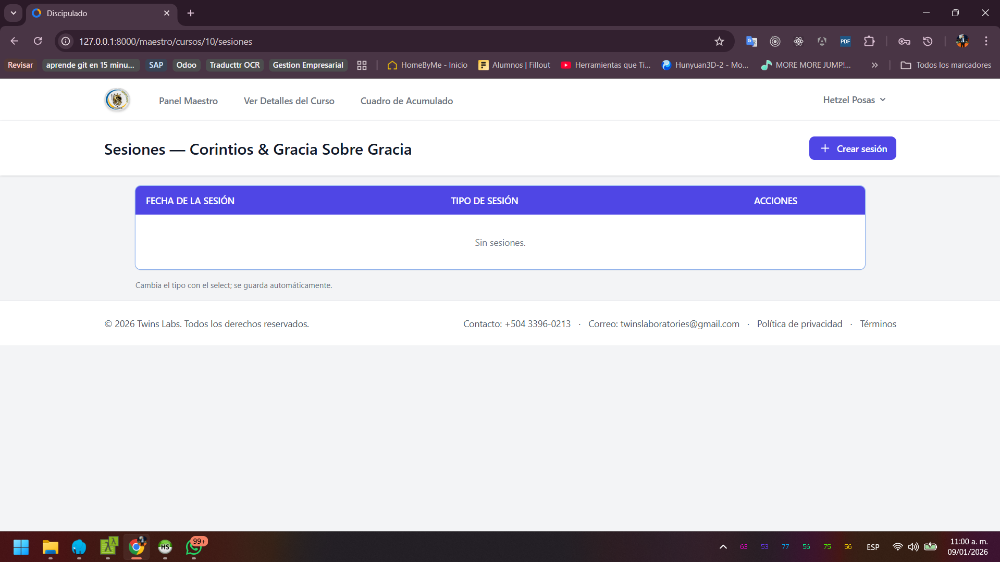 | **Tomar asistencia** - Registro en tiempo real |
| 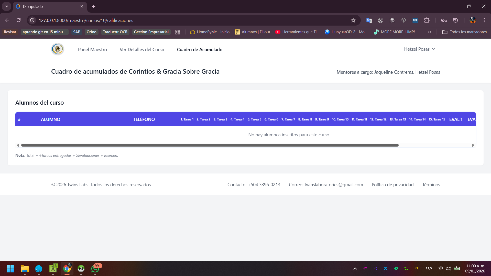 | **Reportes acumulados** - Estadísticas completas |
| 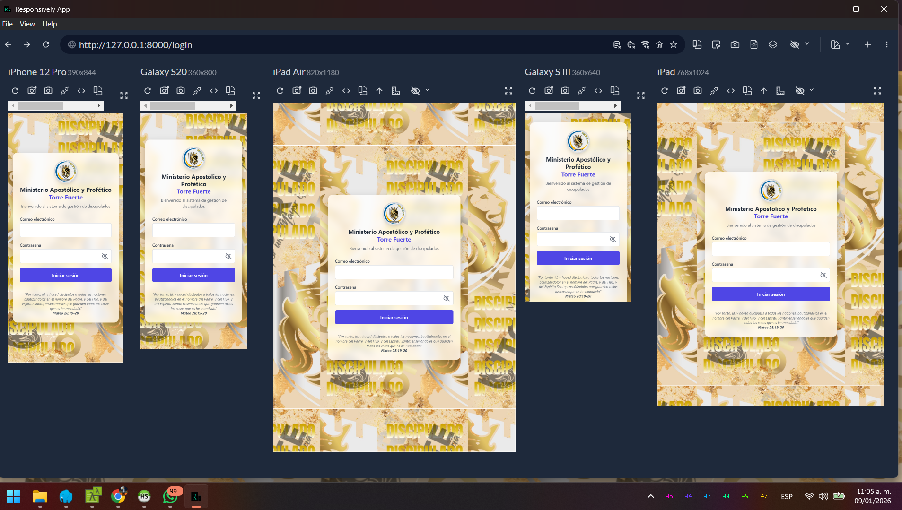 | **Vista móvil 1** - Diseño responsive |
| 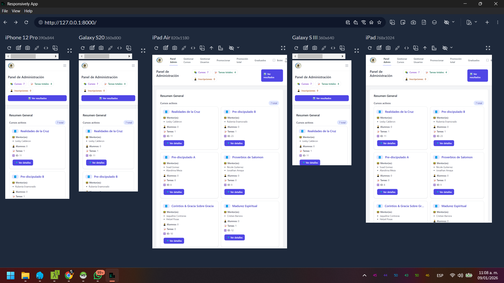 | **Vista móvil 2** - Adaptación mobile |
| 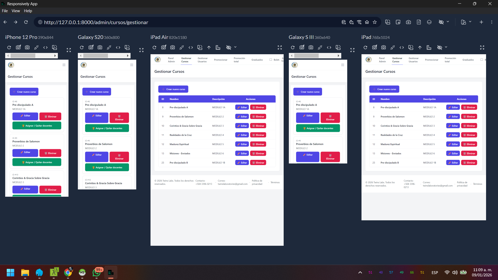 | **Vista móvil 3** - Experiencia móvil |
|  | **Vista móvil 4** - Navegación mobile |

## 🛠️ **Stack Tecnológico:**
- **Backend:** Laravel 12
- **Frontend:** Tailwind CSS + JavaScript
- **Base de datos:** MySQL con migraciones optimizadas
- **Autenticación:** Laravel Breeze personalizado
- **Diseño:** Responsive mobile-first
- **Control de versiones:** Git

## 🎯 **Lógica de Negocio Destacada:**
- Sistema inteligente de promoción automática
- Validación de requisitos para graduación
- Historial completo de cada alumno
- Reportes automáticos de progreso
- Seguimiento en tiempo real
- Alertas y notificaciones automáticas

## 📈 **Estado del Proyecto:**
- ✅ **VERSIÓN 2.5 COMPLETA**
- ✅ **FUNCIONAL Y ESTABLE**
- ✅ **EN PRODUCCIÓN**
- ✅ **DOCUMENTADO**
- ✅ **19 CAPTURAS DE PANTALLA**

---

## 🏆 **Para Portfolio:**
Este proyecto **v2.5** demuestra habilidades avanzadas en:
- Desarrollo de sistemas complejos con lógica de negocio específica
- Arquitectura multi-rol con permisos granularizados
- Despliegue profesional y mantenimiento
- Documentación visual completa con 19 capturas de pantalla
- Experiencia de usuario optimizada para diferentes dispositivos

---

## About Laravel

Laravel is a web application framework with expressive, elegant syntax. We believe development must be an enjoyable and creative experience to be truly fulfilling. Laravel takes the pain out of development by easing common tasks used in many web projects, such as:

- [Simple, fast routing engine](https://laravel.com/docs/routing).
- [Powerful dependency injection container](https://laravel.com/docs/container).
- Multiple back-ends for [session](https://laravel.com/docs/session) and [cache](https://laravel.com/docs/cache) storage.
- Expressive, intuitive [database ORM](https://laravel.com/docs/eloquent).
- Database agnostic [schema migrations](https://laravel.com/docs/migrations).
- [Robust background job processing](https://laravel.com/docs/queues).
- [Real-time event broadcasting](https://laravel.com/docs/broadcasting).

Laravel is accessible, powerful, and provides tools required for large, robust applications.

## Learning Laravel

Laravel has the most extensive and thorough [documentation](https://laravel.com/docs) and video tutorial library of all modern web application frameworks, making it a breeze to get started with the framework.

You may also try the [Laravel Bootcamp](https://bootcamp.laravel.com), where you will be guided through building a modern Laravel application from scratch.

If you don't feel like reading, [Laracasts](https://laracasts.com) can help. Laracasts contains thousands of video tutorials on a range of topics including Laravel, modern PHP, unit testing, and JavaScript. Boost your skills by digging into our comprehensive video library.

## Laravel Sponsors

We would like to extend our thanks to the following sponsors for funding Laravel development. If you are interested in becoming a sponsor, please visit the [Laravel Partners program](https://partners.laravel.com).

### Premium Partners

- **[Vehikl](https://vehikl.com)**
- **[Tighten Co.](https://tighten.co)**
- **[Kirschbaum Development Group](https://kirschbaumdevelopment.com)**
- **[64 Robots](https://64robots.com)**
- **[Curotec](https://www.curotec.com/services/technologies/laravel)**
- **[DevSquad](https://devsquad.com/hire-laravel-developers)**
- **[Redberry](https://redberry.international/laravel-development)**
- **[Active Logic](https://activelogic.com)**

## Contributing

Thank you for considering contributing to the Laravel framework! The contribution guide can be found in the [Laravel documentation](https://laravel.com/docs/contributions).

## Code of Conduct

In order to ensure that the Laravel community is welcoming to all, please review and abide by the [Code of Conduct](https://laravel.com/docs/contributions#code-of-conduct).

## Security Vulnerabilities

If you discover a security vulnerability within Laravel, please send an e-mail to Taylor Otwell via [taylor@laravel.com](mailto:taylor@laravel.com). All security vulnerabilities will be promptly addressed.

## License

The Laravel framework is open-sourced software licensed under the [MIT license](https://opensource.org/licenses/MIT).
